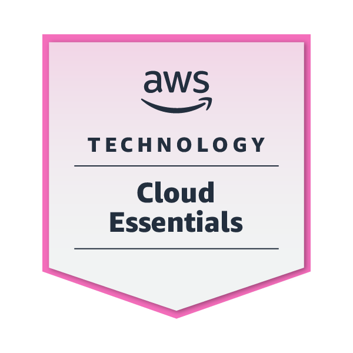

### Hi there 👋
I'm a full-stack software engineer with **5 years of professional experience**, building purpose-driven projects for the people.

🔭 I’m currently working at Luxury Escapes, building [getkitchentable.app](https://getkitchentable.app) - a financial planning app for everyday people. 
🌱 I’m currently perfecting app development and cloud technologies. 
👯 I’m open to collaborating on purpose-driven community projects. 
📫 How to reach me: chaudhari.yogesh20@gmail.com 
⚡ Fun fact: No Facebook or Instagram.

### What I'm Building
🍳 **[getkitchentable.app](https://getkitchentable.app)** - a financial planning app for everyday people. 
🌿 **[My North Star – Minimalism](https://chromewebstore.google.com/detail/my-north-star-%E2%80%93-minimalis/nmcfhegoogadlfmjdafppdpmbbndknon?utm_source=item-share-cb&pli=1)** - a Chrome extension for intentional living.

### My Socials
   

### My Tech Stack
  

 

    

### My Technical Badges
##### Foundational
